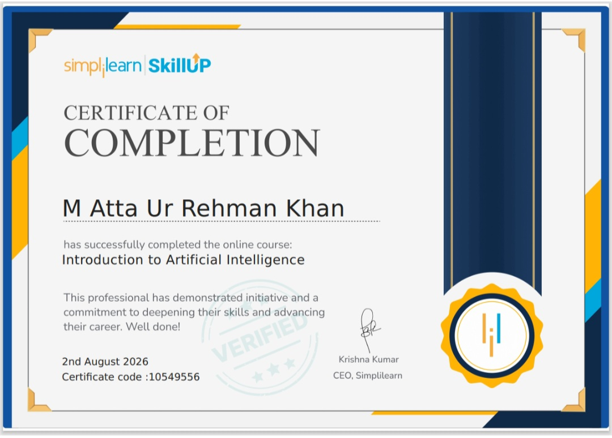
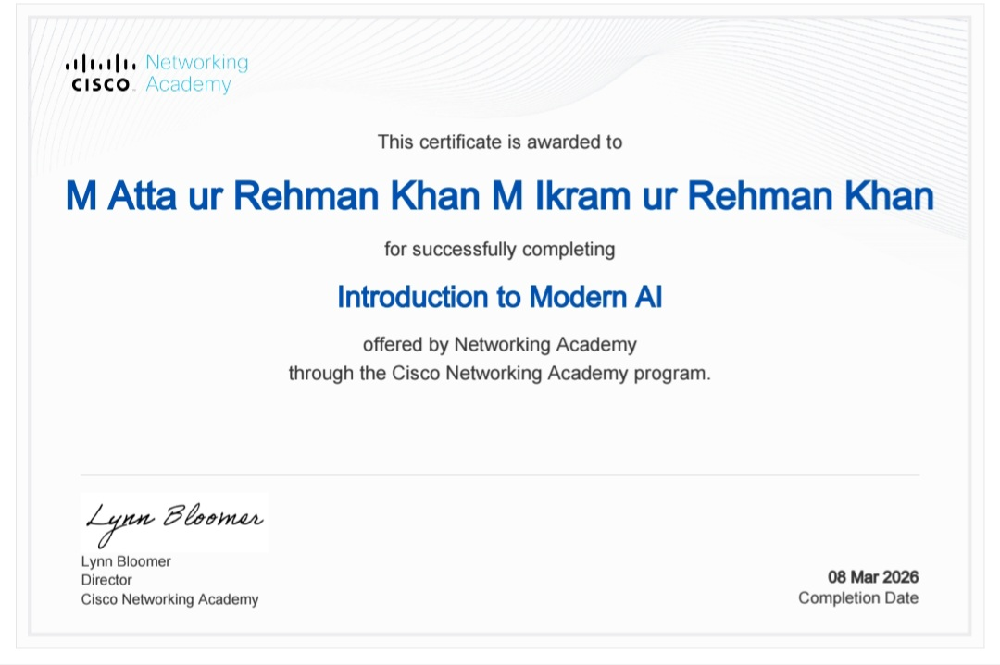
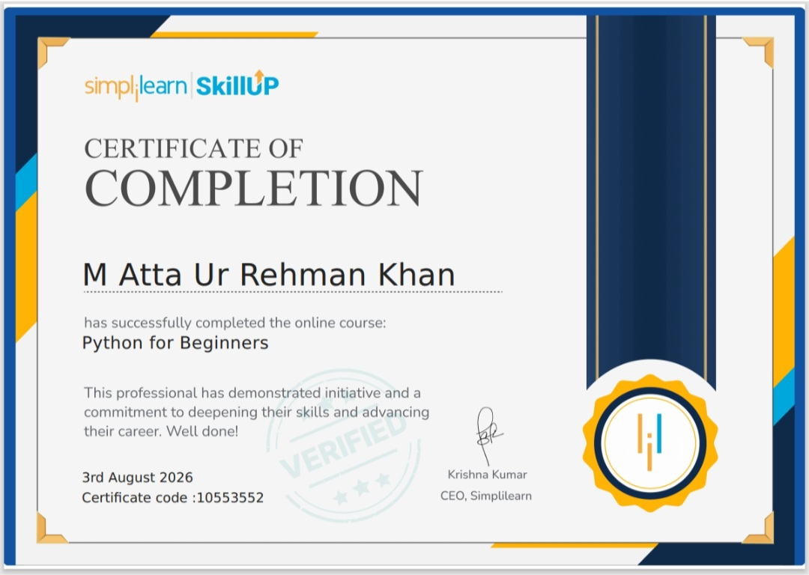
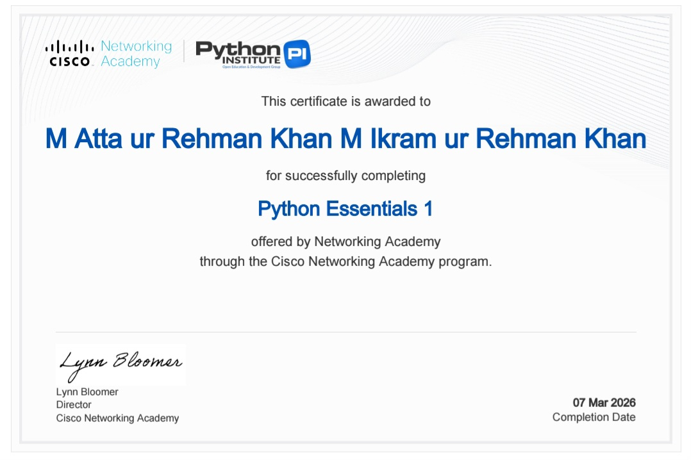
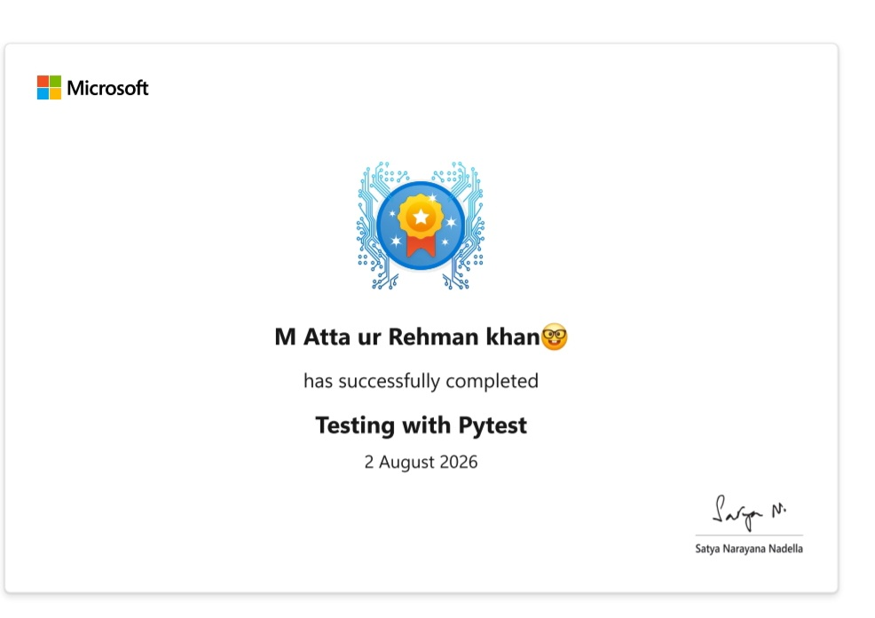
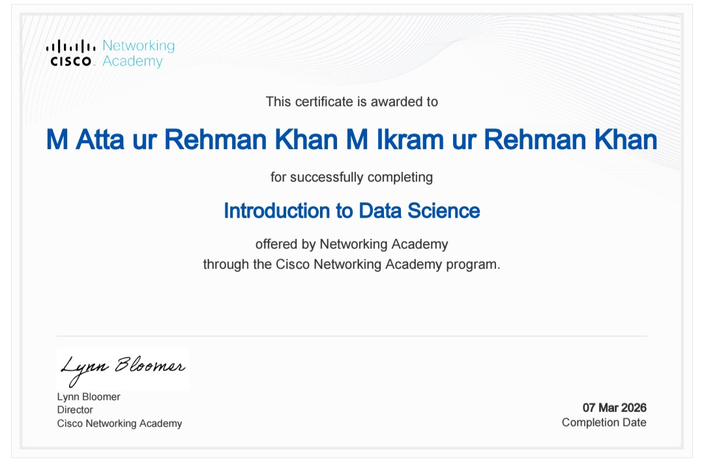
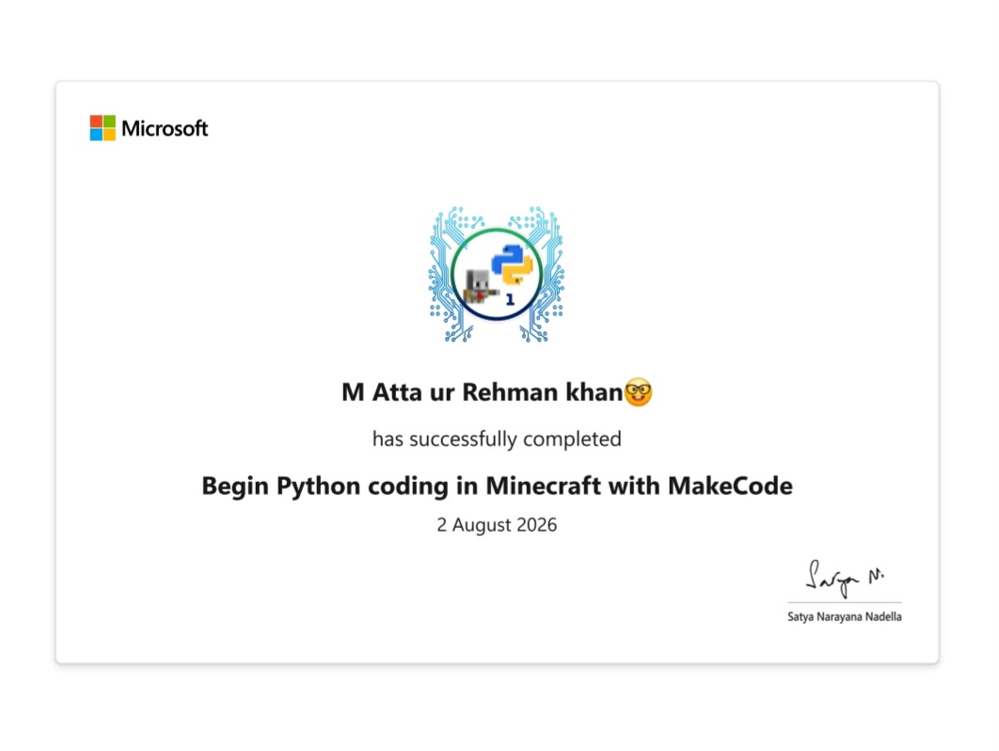
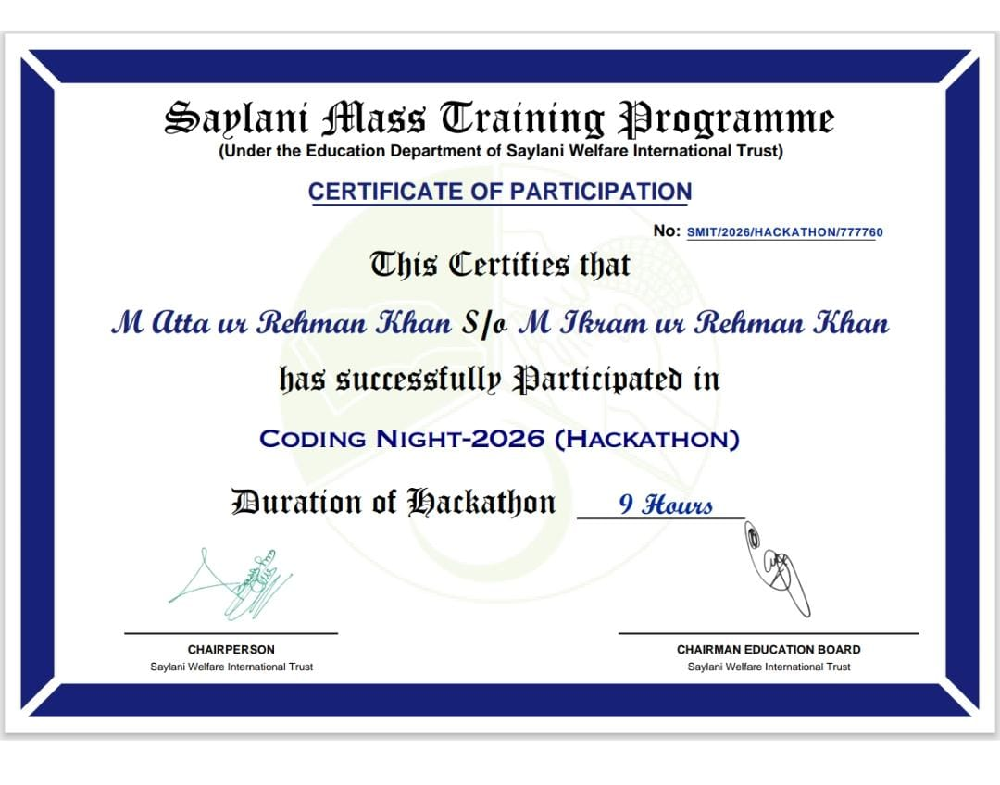

# Hi 👋, I'm M. Atta Ur Rehman Khan (Atta Rehman Rao)
### Passionate AI Developer, Python Programmer & Data Specialist!

---

## 👨‍💻 Connect with me:

  
  
  

---

## 🛠️ Languages and Tools:

  
  
  
  
  

---

## 🏆 My Verified Certifications (11)
### My journey of continuous learning in AI, Data Science & Software Engineering

Below is the structured showcase of all 11 professional certificates issued by **Cisco, Microsoft, and Simplilearn SkillUp**:

---

### 🤖 Artificial Intelligence & Machine Learning

| Course / Certification | Issuer | Certificate Preview |
| :--- | :--- | :--- |
| **Introduction to Artificial Intelligence** | Simplilearn SkillUp |  |
| **Artificial Intelligence Beginners Guide** | Simplilearn SkillUp |  |
| **Cisco Modern AI** | Cisco |  |

---

### 🐍 Python Programming & Development

| Course / Certification | Issuer | Certificate Preview |
| :--- | :--- | :--- |
| **Python for Beginners** | Simplilearn SkillUp |  |
| **Cisco Python Essentials 1** | Cisco |  |
| **Cisco Python Essentials 2** | Cisco |  |
| **MS Pytest Framework** | Microsoft |  |

---

### 📊 Data Science, Applied Projects & Hackathons

| Course / Certification | Issuer | Certificate Preview |
| :--- | :--- | :--- |
| **Cisco Data Science** | Cisco |  |
| **MS Copilot Mini Game** | Microsoft |  |
| **MS Minecraft Python** | Microsoft |  |

| **Coding Night Hackathon** | Hackathon |  |

---
