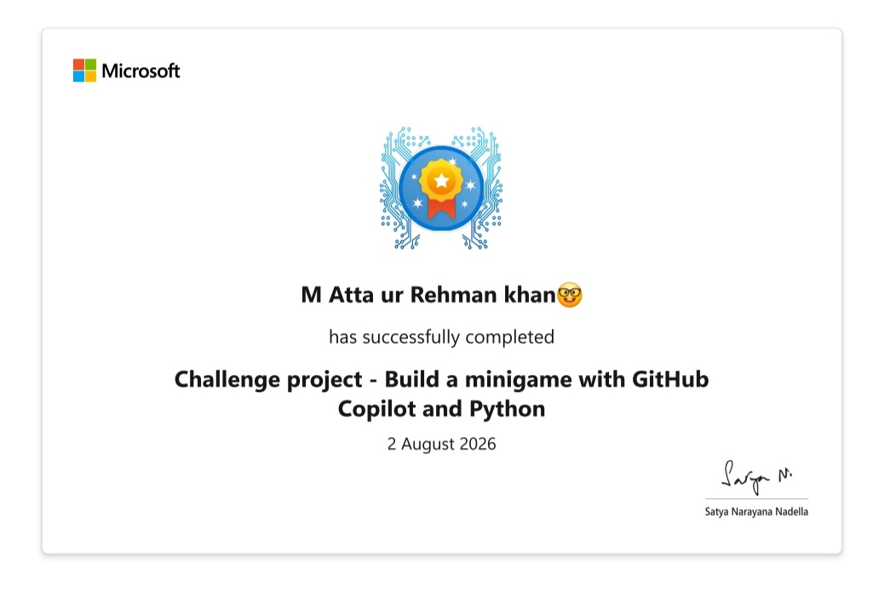

<h1 align="center">Hi 👋, I'm M. Atta Ur Rehman Khan</h1>
<h3 align="center">🤖 Passionate AI Developer | 🐍 Python Programmer | 📊 Data Specialist</h3>

  

---

## 🚀 About Me

🎖️ **Ex-Army Soldier** turned tech enthusiast — discipline and consistency drive everything I build.
🐍 Currently **learning Python** and strengthening my programming foundation.
🧠 **Enrolled in Artificial Intelligence & Data Science**, exploring how algorithms and data power intelligent systems.
🏏 A passionate **cricket lover** in my free time.

> 🎯 **Future Goal:** To become a skilled **AI Engineer** 🤖 and join a leading AI industry — building **AI-powered websites 🌐, applications 📱, and games 🎮** that create real impact.

- 🔭 Currently working on: **Python & AI-based mini projects**
- 🌱 Currently learning: **Python, Data Science & AI fundamentals**
- 💬 Ask me about: **Python, AI Basics, Data Science**
- 📫 Reach me at: **attarehmanrao@gmail.com**
- ⚡ Fun fact: **Discipline from the army, curiosity from AI!**

---

## 👨‍💻 Connect with me

  
  
  

---

## 🛠️ Languages & Tools

  
  
  
  
  

---

## 📊 GitHub Stats

  
  

  

---

## 🏆 My Verified Certifications (11)
### 🎓 A journey of continuous learning in AI, Data Science & Software Engineering
All certificates issued by **Cisco, Microsoft, and Simplilearn SkillUp**. 📸 Click any certificate name to view the full image.

---

### 🤖 Artificial Intelligence & Machine Learning
| Certification | Issuer | Preview |
| :--- | :--- | :---: |
| [🧠 Introduction to Artificial Intelligence](intro_to_ai.jpg) | Simplilearn SkillUp |  |
| [🤖 Artificial Intelligence Beginners Guide](ai_beginners_guide.jpg) | Simplilearn SkillUp |  |
| [⚙️ Cisco Modern AI](cisco-modern-ai.jpg) | Cisco |  |

---

### 🐍 Python Programming & Development
| Certification | Issuer | Preview |
| :--- | :--- | :---: |
| [🐍 Python for Beginners](python_for_beginners.jpg) | Simplilearn SkillUp |  |
| [💻 Cisco Python Essentials 1](cisco-python-essentials-1.jpg) | Cisco |  |
| [💻 Cisco Python Essentials 2](cisco-python-essentials-2.jpg) | Cisco |  |
| [✅ MS Pytest Framework](ms-pytest.jpg) | Microsoft |  |

---

### 📊 Data Science, Applied Projects & Hackathons
| Certification | Issuer | Preview |
| :--- | :--- | :---: |
| [📈 Cisco Data Science](cisco-data-science.jpg) | Cisco |  |
| [🎮 MS Copilot Mini Game](ms-copilot-minigame.jpg) | Microsoft |  |
| [⛏️ MS Minecraft Python](ms-minecraft-python.jpg) | Microsoft |  |
| [🌙 Coding Night Hackathon](coding-night-hackathon.jpg) | Hackathon |  |

---

  ⭐ <b>Thanks for visiting my profile! Let's build something amazing with AI.</b> ⭐

